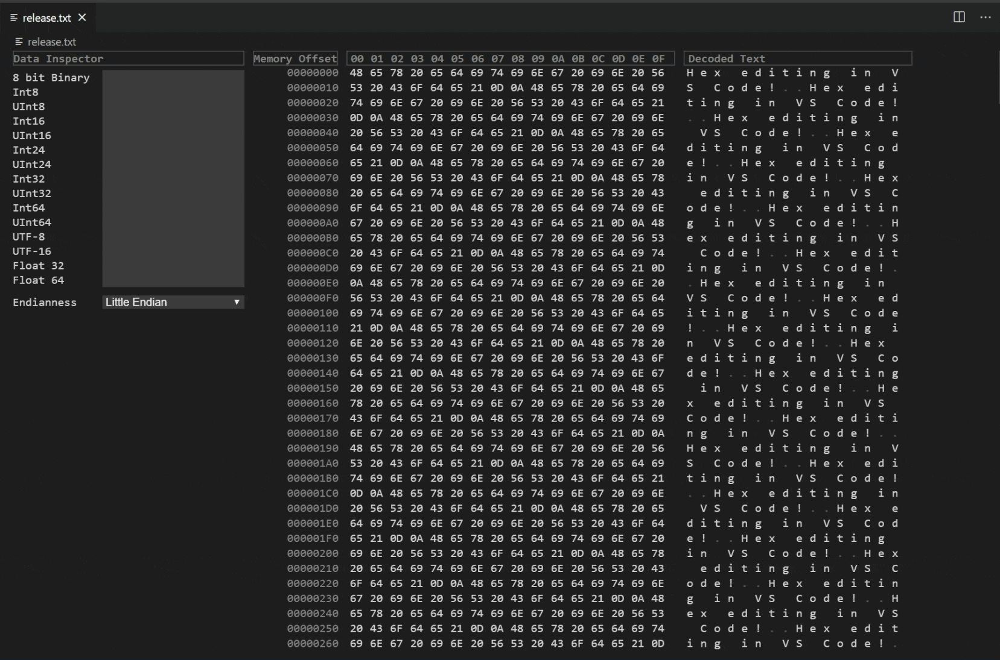

# VS Code Hexeditor

**Note: This editor currently only supports reading, and not writing.**

This an extension for Visual Studio Code 1.46+ which utilizes the custom editor API to allow viewing files as hex within VS Code.

## Features

- Opening files as HEX
- Navigating and scrolling through them
- Viewing the hex values in various different formats



## Requirements

- Visual Studio Code 1.46+

## How to Use
There are three ways to open a file as hex
1. Trigger the command palette (Ctrl / Cmd + Shift + P) -> Reopen With -> Hex Editor
2. Right click a file -> Open With -> Hex Editor
3. Trigger the command palette (Ctrl / Cmd + Shift + P) -> Open File using Hex Editor

If you would like to use the hex editor as the default hex editor for certain file types you can add the `workbench.editorAssocations` setting to your `settings.json`.

For example, this would associate all files with .hex or .ini to open by default in the hex editor
```json
    "workbench.editorAssociations": [
        {
            "viewType": "hexEditor.hexedit",
            "filenamePattern": "*.hex"
        },
        {
            "viewType": "hexEditor.hexedit",
            "filenamePattern": "*.ini"
        }
    ],
```

## Extension Settings

This extension contributes the following settings:

* `hexeditor.maxFileSize`: How many MB you want the editor to try to open before warning you with the open anyways message

## Known Issues

- Currently No major issues

To track all issues / file a new issue please go to the Github repo https://github.com/microsoft/vscode-hexeditor/issues

## Release Notes

### 1.0.0

- Hex Editor initial release

### 1.0.1
- Add instructions to the README on how to use the extension
- Add an Open with HexEditor command

-----------------------------------------------------------------------------------------------------------

## Code of Conduct
https://opensource.microsoft.com/codeofconduct
